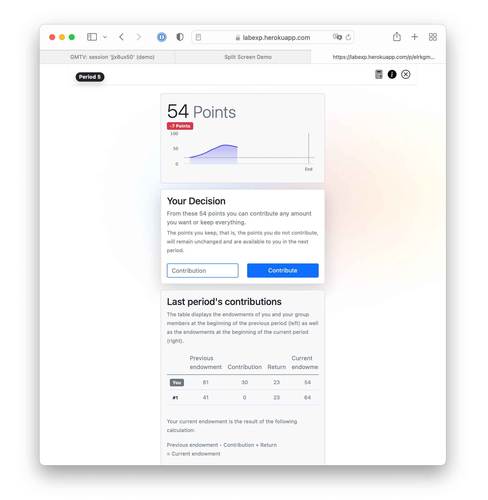

Made with [oTree](https://www.sciencedirect.com/science/article/pii/S2214635016000101) and ❤️

# Dynamic Public Goods Game

This experiment replicates Gächter et al.'s [(2017, Journal of Public Economics)](https://www.sciencedirect.com/science/article/pii/S0047272717300361)
dynamic public goods game -- the 10-period no punish treatment, to be precise.

The original game is a public goods game where each player's current endowment is the sum of her initial endowment and
gains or losses from previous periods. Hence, period endowments are incomes of previous periods and both growth as well
as inequality arise endogenously.

Parts of the original experiment have been replicated [online and remote](https://doi.org/10.1007/s10683-017-9527-2).
The corresponding code is based on a previous otree version and thus stored in another project. To access the code as
well as the **corresponding data**, click [here](GMTV.md).

## 🔜 Next up
We want to incorporate an exogenous risk of extreme weather events that cause an endogenous damage. The rationale behind that is quite
intuitive: extreme weather events cannot be prevented in the short run but their damage can be controlled -- the more
a society contributes to a public good the lower the damage if an extreme weather event occurs.

The design is implemented using the `B_EWE` App, which you can find [here](otreeLite/B_EWE) and is based on the basic [GMTV](otreeLite/B_GMTV) setting.

## 🚏 How you can access a demo
You can find the experiment's demo [here](https://labexp.herokuapp.com/demo/). A click on _GMTV_
will open a new tab with several URLs. I'd advice you to click on the Hyperlink called _Play in split screen mode._

