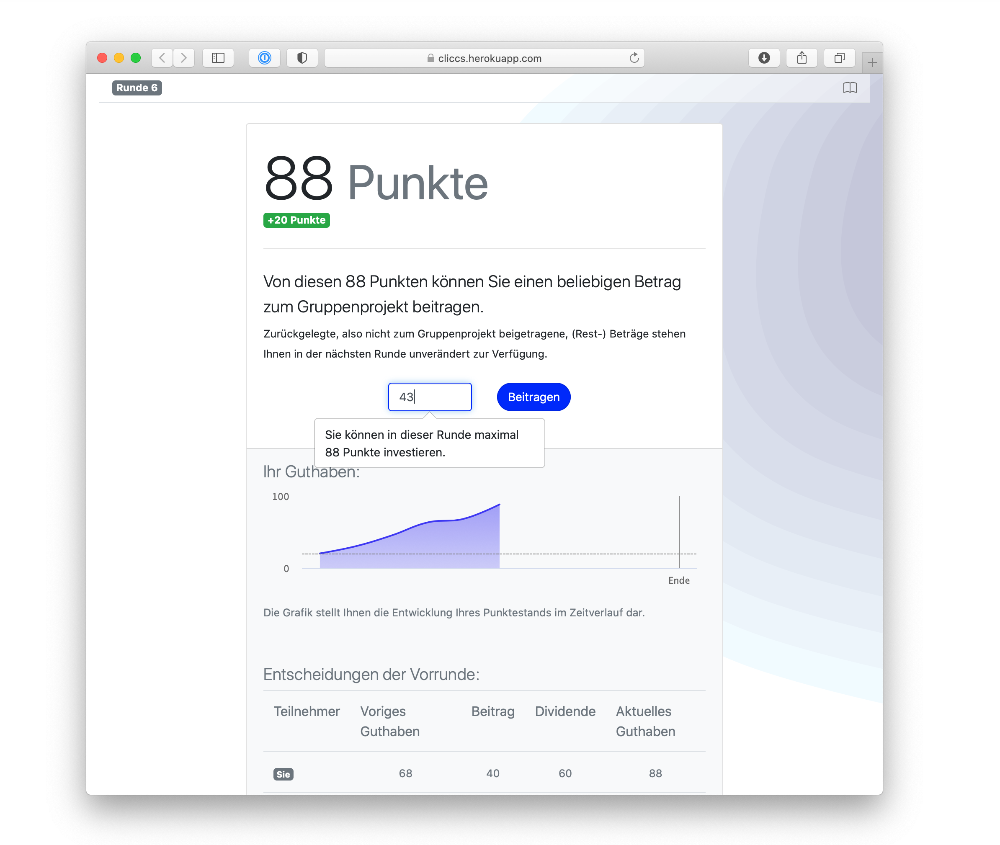

# 🤷‍ Cooperation in uncertain times

Made with [oTree](https://www.sciencedirect.com/science/article/pii/S2214635016000101) and ❤️

## 🧐 What the project is about
This experiment replicates Gächter et al.'s [(2017, Journal of Public Economics)](https://www.sciencedirect.com/science/article/pii/S0047272717300361)
dynamic public goods game and incorporates uncertainty. 

The original game is a public goods game where each player's current endowment is the sum of her initial endowment and 
gains or losses from previous periods. Hence, period endowments are incomes of previous periods and both growth as well 
as inequality arise endogenously.

## 🎓 Academic Contributions
Gächter et al used this design to investigate growth, inequality and cooperation. We would like to extend the game by
incorporating uncertainty as well. Doing so, we want to model uncertainty from arising extreme weather events that are
expected to become more severe and frequent due to climatic change.

One can think of extreme weather events as destroying income as well as productivity. Therefore, we can incorporate
uncertain shocks to both the endowment as well as the marginal per capita return (MPCR). In addition, one could think of 
prevention as a public good. By contributing to this good, players can reduce the extreme weather events' damage, while
their frequency remains unaffected (because there is nothing to do about it in the short term).

## ✅ To do

A kanban board can be found [here](https://github.com/Howquez/coopUncertainty/projects/1). In addition, there are some
strategic and more general decisions to be made. That is, we have to decide whether...
- [ ] we want to model prevention, i.e. whether the damage depends on contributions
- [ ] we want to frame it as a public goods or public bad game
- [ ] the endowment and/or MPCR shall be affected
- [ ] damage shall be heterogeneous within groups

We also have to think about ways to conduct the experiment during COVID-19. These consideration may have
consequences for the number of rounds and group sizes.

## 🚏 How you can access a demo
You can find the experiment's demo [here](https://cliccs.herokuapp.com/demo/). A click on _Dynamic Public Goods Game_ 
will open a new tab with several URLs. I'd advice you to click on the Hyperlink called _Play in split screen mode._

## 🛠 How we built it
The experiment is built in Python 3 using [oTree](https://www.sciencedirect.com/science/article/pii/S2214635016000101).
So far, one can consider the game as an MVP -- it therefore only contains constant and homogeneous shocks to the 
players' endowments. 

## 📖 Read the Docs
I am creating a wiki over [here](https://github.com/Howquez/coopUncertainty/wiki).